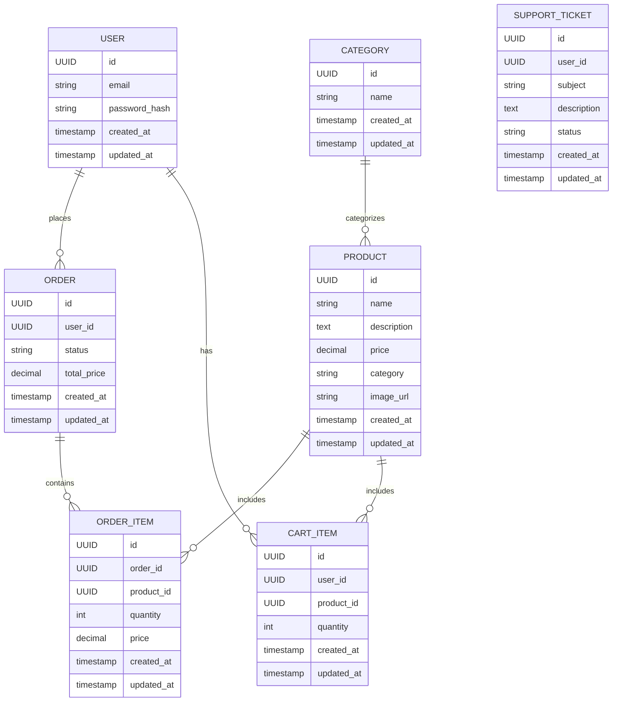

# Database Schema

_What are the main entities and relationships in your data model?_

---

## ER Diagram

---

## Description

The database schema is designed to support an e-commerce platform. The main entities include USERS, PRODUCTS, CATEGORIES, CART_ITEMS, ORDERS, ORDER_ITEMS, and SUPPORT_TICKETS. These entities interact to provide a seamless shopping experience.

- **Users**: Manage user accounts and authentication.
- **Products**: Store product details, including descriptions and prices.
- **Categories**: Organize products into logical groups.
- **Cart Items**: Track items added to the shopping cart.
- **Orders**: Represent completed transactions.
- **Order Items**: Detail the products within each order.
- **Support Tickets**: Facilitate customer support interactions.

For example, a user can browse products by category, add items to their cart, and place an order. Each order is linked to the user profile, enabling order tracking and history. Support tickets allow users to resolve issues efficiently.
